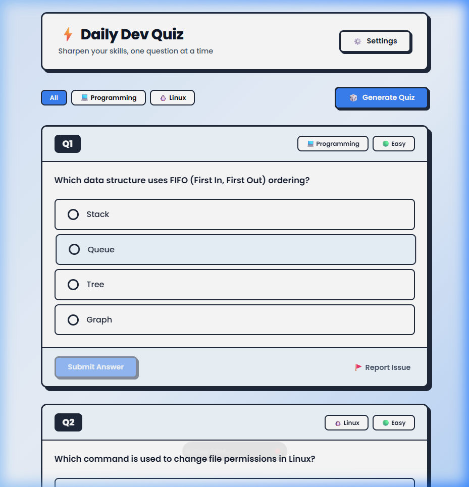
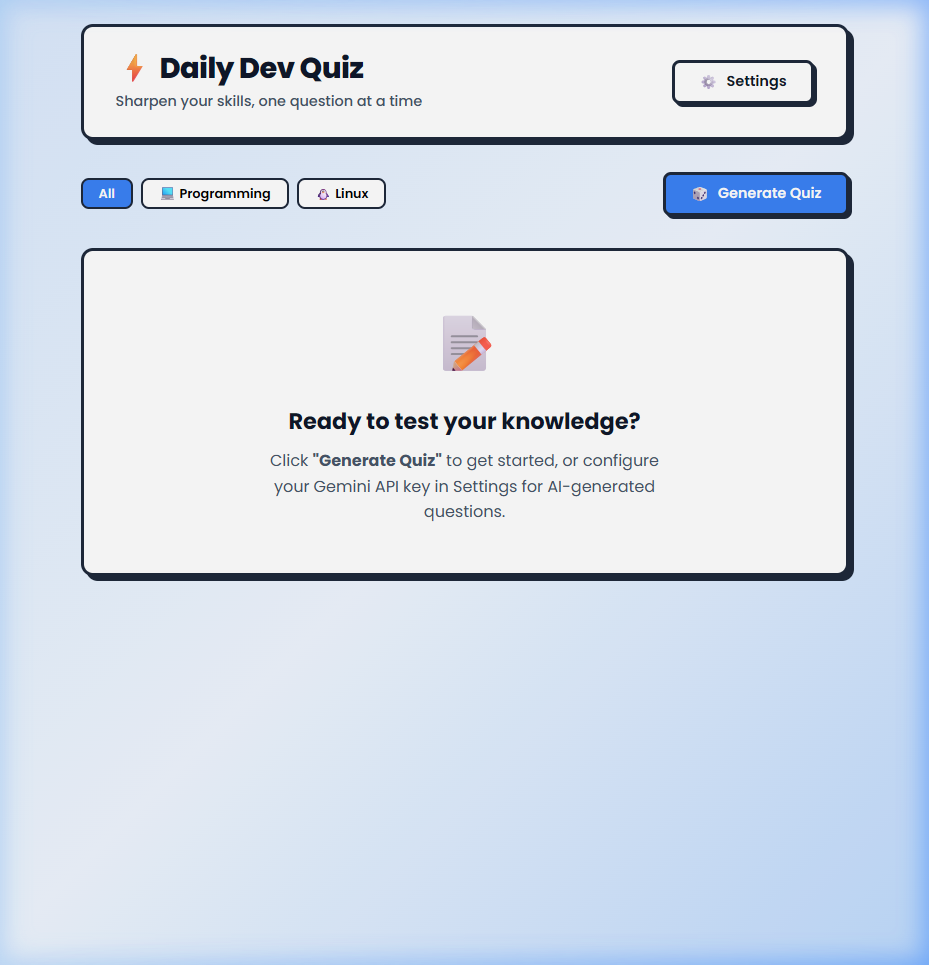
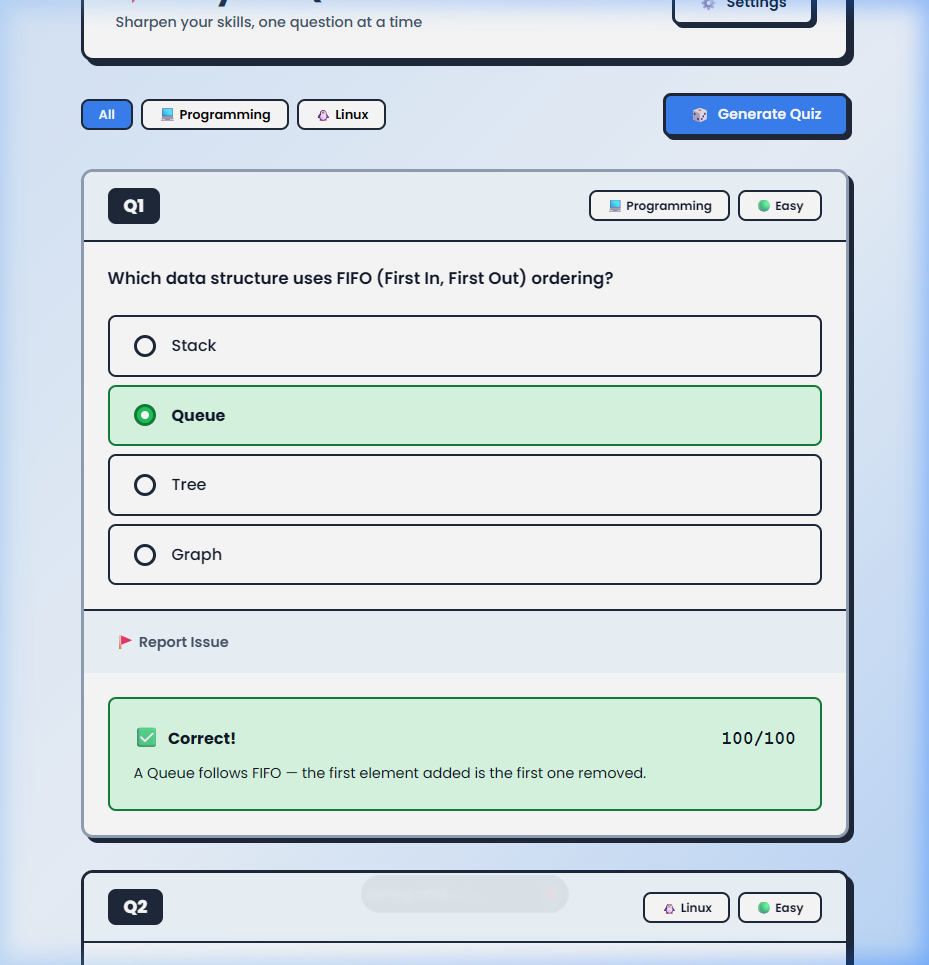
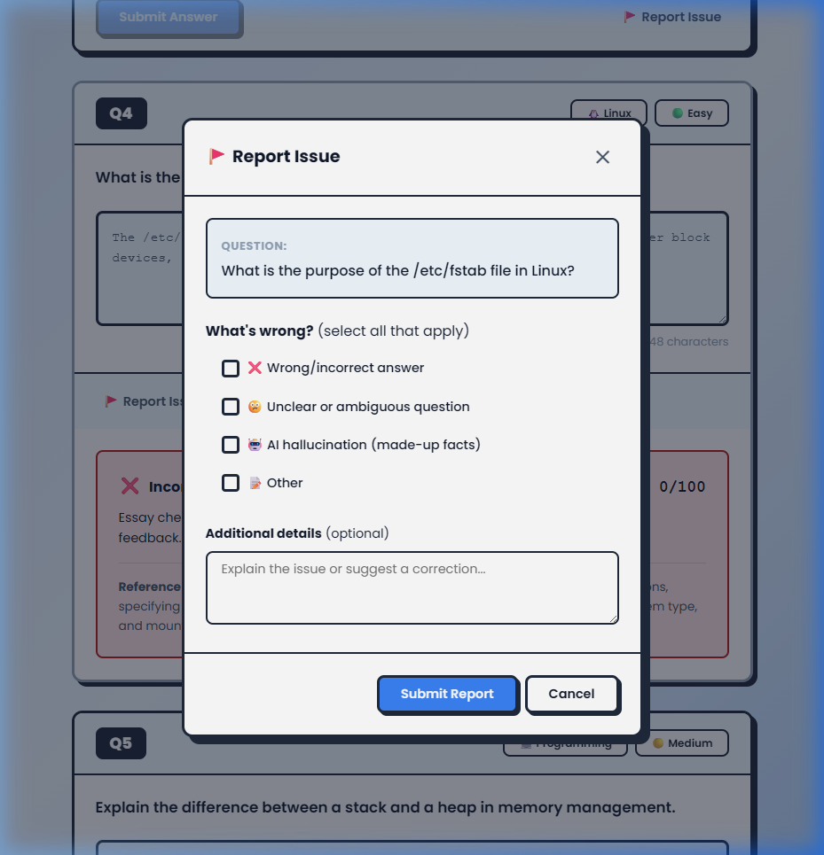

# ⚡ Daily Dev Quiz

A daily programming and Linux configuration quiz app to sharpen your developer skills — one question at a time.

Built with **Vite + vanilla JS**, styled in **neobrutalism**, powered by **Gemini AI** for question generation and essay grading.



---

## ✨ Features

- **AI-generated questions** — programming concepts, algorithms, Linux commands, shell scripting & more
- **Multiple-choice** — radio button selection with instant correct/incorrect feedback
- **Essay answers** — free-text input with AI-powered grading and constructive feedback
- **Report issues** — flag wrong answers, unclear questions, or AI hallucinations
- **Fallback mode** — works without an API key using built-in questions
- **Settings panel** — configure API key, question count, categories, and optional database
- **Neobrutalism UI** — bold borders, solid shadows, light blue gradient, Poppins font

---

## 🚀 Getting Started

### Prerequisites

- [Node.js](https://nodejs.org/) v18+

### Install & Run

```bash
# Install dependencies
npm install

# Start dev server (opens http://localhost:3000)
npm run dev
```

### Enable AI Features (optional)

1. Get a free API key from [Google AI Studio](https://aistudio.google.com/apikey)
2. Open **Settings** ⚙️ in the app
3. Paste your Gemini API key and save

Without an API key, the app uses built-in fallback questions.

---

## 📖 Usage Guide

### 1. Start Screen

When you first open the app, you'll see the empty state prompting you to generate a quiz.



### 2. Generate a Quiz

Select a category (**All**, **Programming**, or **Linux**) and click **"Generate Quiz"**. Questions load as cards with badges showing category and difficulty.


### 3. Answer Questions

- **Multiple-choice**: Select a radio button and click **Submit Answer**. The correct answer highlights green, wrong answers highlight red, and an explanation is shown.
- **Essay**: Type your answer in the text area and submit. With an API key, Gemini grades your answer (0–100) with detailed feedback.



### 4. Configure Settings

Click **Settings** ⚙️ to manage:
- **Gemini API Key** — required for AI question generation and essay grading
- **Quiz Preferences** — number of questions per quiz, default category
- **Database** — toggle between localStorage (default) and Supabase for long-term persistence


### 5. Report Bad Questions

Click **🚩 Report Issue** on any question card to flag problems:
- Wrong/incorrect answer
- Unclear or ambiguous question
- AI hallucination (made-up facts)
- Other issues with free-text comment



---

## ⚙️ Configuration

| Setting | Location | Description |
|---------|----------|-------------|
| Gemini API Key | Settings → API Key | Enables AI question generation and essay grading |
| Questions per quiz | Settings → Preferences | 3, 5, 8, or 10 questions |
| Default category | Settings → Preferences | All, Programming, or Linux |
| Storage backend | Settings → Database | localStorage (default) or Supabase |
| Supabase URL/Key | Settings → Database | For long-term cloud persistence |

---

## 📁 Project Structure

```
programmer-quiz/
├── index.html                    # Entry HTML
├── package.json                  # Dependencies & scripts
├── vite.config.js                # Vite configuration
├── .gitignore
├── docs/
│   └── images/                   # Documentation screenshots
├── src/
│   ├── main.js                   # App entry point
│   ├── ai-client.js              # Gemini API wrapper
│   ├── quiz-engine.js            # Quiz state, scoring, fallback questions
│   ├── style.css                 # Neobrutalism CSS theme
│   └── components/
│       ├── quiz-card.js           # Question card (MC / essay)
│       ├── settings-panel.js      # API key, prefs, DB config
│       └── feedback-modal.js      # Report issue modal
└── .agents/
    ├── SKILL.md                   # Project skill metadata
    └── skills/
        └── documentation/
            └── SKILL.md           # Documentation skill
```

---

## 🛠️ Tech Stack

| Technology | Purpose |
|------------|---------|
| Vite | Dev server & build tool |
| Vanilla JS | No framework — lightweight & fast |
| Poppins | Body font (Google Fonts) |
| Monospace | Code sections & scores |
| Gemini API | AI question generation & essay grading |
| localStorage | Default client-side storage |
| Supabase (optional) | Cloud database for persistence |
